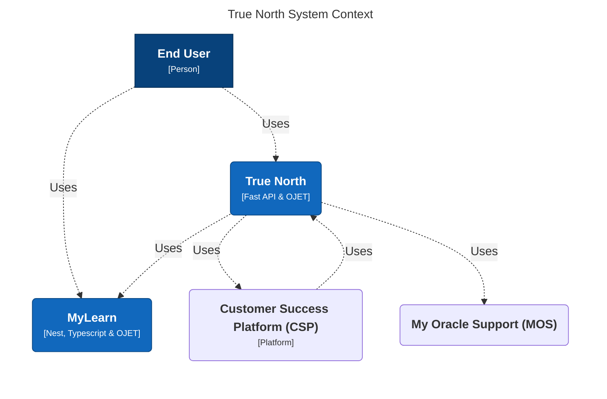

# Welcome Aboard: New Member's Guide to the True North (TN) / Customer Success Platform (CSP)

We are delighted to welcome you to our team. Recognizing that the abundance of information can be quite overwhelming for newcomers, we have thoughtfully crafted this guide to help you navigate your initial steps. We hope you find this guide valuable as you embark on your journey with us!

## Comprehensive Perspectives
During your first few days, there will be an onboarding session. Please be sure to attend.

The following steps involve configuring essential tools to connect you with Oracle's intranet.

Please ensure that you address each of the following points.

1. Participate in the employee onboarding session conducted by the HR team for new hires.
2. As highlighted during your onboarding session, please remember to sign your documents and send them via email.
3. Access your Oracle's account. For additional details, please refer to the 'Accessing to your Oracle's email' section below.
4. Configure your Virtual Private Network (VPN). Further instructions on accessing the VPN will be provided in your email.
5. Review your new employee checklist at https://mysites.oracle.com/newemployees/new-employee-checklist.html (Requires VPN).
6. The access to your slack will be granted within 24 hrs after HR after Aria/Connections. More info at Getting Access To Slack.
7. Complete all the requirements listed in the 'Mandatory Courses and Development Courses' sections (below).
8. Configure the MyLearn and Learn systems on the equipment provided by Oracle. For additional details, please consult the 'Configuration for Development' section below.
9. Thoroughly examine and study all the subjects outlined in the 'Development Prerequisites' section.
10. Activate your YubiKey for OCNA and OCI: Ordering and Activating your YubiKey for OCNA and OCI - OCI Integration and Development - ALM Confluence (oraclecorp.com)
11. Connect to the OCNA VPN: Connecting to the OCNA VPN - OCI Integration and Development - ALM Confluence (oraclecorp.com)

---

## Configuration for Development

As part of our team, it will be required to set up MyLearn and Learn. 

Consequently, there are certain credentials (tagged by entitlements) that must be requested at https://oim.oraclecorp.com. This can be consulted at section 'OIM Access Request' at Platform Onboarding - CSS Engineering Team Center - ALM Confluence (oraclecorp.com) .

For entitlements related to Learn, it is essential to follow the steps outlined in OCI Access. Please carefully review this link before requesting any entitlements.

Likewise, for setting up the MyLearn environment, please follow the steps provided in the Development environment setup.

The table below summarizes the entitlements required for MyLearn and Learn, respectively.

| Entitlements of MyLearn | Entitlements of Learn |
| ----------- | ----------- |
| ALM JIRA UA (Jira ODCS Developers) | pe-app-dev |
| Jira ODCS Developers (ALM JIRA PROD) | CSS-PEO-APPDEV-Team |
| oud-dev_developer | css_appbastion_nonprod (**TODO**: add link to section below showing the justification based on an email I have got) |
|oud-dl_developer | pe_appeng |
| | OraManagement-SRE PRODAPP |
| | css_appbastion_prod |
| |  oit-users |
| |  Jira ODCS Users |
| |  Jira ODCS |
| |  Developers (ALM JIRA PROD)|

### MyLearn Setup
This step requires going through the following points (Development environment setup):

1. MyLearn Setup:
    1. MyLearn Setup with WSL2 Setup (Windows). If you encounter any difficulties during this point, you can seek assistance from Joel Chacon 
    2. MyLearn Setup with WSL2 Setup (MAC)
2. MyLearn DB Setup
3. MyLearn Indexing Process

### Learn Setup
Furthermore, there will be a need to perform a partial setup of Learn, specifically in two sections: 'Initial Setup' and 'DB Connections' which can be located in Learn Setup.

---

## Accessing to your Oracle's email
To gain access to your Oracle email (available at https://outlook.office.com/mail/), kindly request your personal information from your manager:

- Username 
- Password (According to policies, it will be provided by a phone call)
- Global User ID (GUI)

During this process, the system will require you to set up two-factor authentication, where your phone number will be used initially (please ensure it includes the country code).

Additionally, it's important to promptly reset your Single Sign-On (SSO) password by visiting https://myhelp.oracle.com/app/answers/answer_view/a_id/1013794. If you encounter any difficulties accessing to your account, please reach out to IT-support at the phone number designated for your country (for example, Mexico: +52 33 2992 4643). If the Spanish-language services are busy, you may opt for the English option.

At this stage, all the necessary information to access the Oracle Virtual Private Network (VPN) will be provided in your email. This step is crucial, as some sites may require you to be logged into the VPN.

--- 

Mandatory Courses and Development Courses
There are several mandatory HR process-related courses that you must complete within a maximum of two months. You can find additional information at https://learning.oracle.com.

Furthermore, there are three essential developer trainee courses that you must successfully complete. These courses are categorized as 'required' in the CSS Platform (SMP 2.0) Prerequisite Training. Specifically, they are:

- OCI Cloud Fundations Associate: https://mylearn.oracle.com/ou/learning-path/become-an-oci-foundations-associate-2023/122043 
- OCI Security Training: https://mysites.oracle.com/Global-Product-Security/security-training.html
- OraHub Training:  https://confluence.oci.oraclecorp.com/display/ORAHUB/OraHub+Training
    - In this case you need to request access with entitlement OCI Stack. More information at Requesting Access to OCI Tools - OCI Integration and Development - ALM Confluence (oraclecorp.com)[**TODO**: This step seems to have an issue when accessing to https://permissions.oci.oraclecorp.com/]

--- 

## Development Prerequisites
These prerequisites are designed to provide both theoretical and practical foundations for the team. However, if you wish to consult additional external materials, you are welcome to do so.

The majority of these prerequisites can be reviewed at https://oradocs.oracle.com/documents/folder/F0D9DE8AB00096B19152C7E6EE76910D6B744207F07D/_CSS_Research (please request access from Fabrizio Barisione).

- Virtual machines and containers
    - Understand the basics of Monolith and Microservices architecture
- Review about Domain-Driven Design, i.e. get the basics of it.
- Docker
    - https://youtu.be/WoZobj2Ruj0
- Kubernetes
    -https://www.youtube.com/watch?v=X48VuDVv0do (Try it locally)
- Redis
    -https://redis.io/docs/about/
- Concept of DB sharing(basics)
    - https://en.wikipedia.org/wiki/Shard_(database_architecture)
- Get a basic understanding of relational and non-relational database management systems as well as Graph DBs.
- https://oradocs.oracle.com/documents/folder/F0D5B5AEE29EFEE4101BC09234263ED8005375A7509F/_GraphQL_and_BFF (request access)
- Fast API
    - https://oradocs.oracle.com/documents/fileview/D455CC26B0B30ED15416F5B8A1653C6920F0372E8ADF/_FastAPI_System_Setup.mp4 (request access)
    - https://oradocs.oracle.com/documents/fileview/DCB11A665C6CB082C943CAE12D2A3AFDF4A3A4A6C3B5/_FastAPI-POC.mp4 (request access)
    - https://oradocs.oracle.com/documents/fileview/D00C59E850BD8E6823649104EB6480019BC4349F71D5/_FastAPI.pptx (request access)
- Observability
    - https://oradocs.oracle.com/documents/fileview/D843C8CD8057F4A5F3FA6F7CFF149982C4F327F87FC7/_Observability_.pptx (request access)
    - https://oradocs.oracle.com/documents/fileview/DBE701BA37073158796A58FD7DA2BAE382F1FD5C7A1B/_Observability.mp4 (request access)
- Unit and integration testing
    - https://oradocs.oracle.com/documents/fileview/D940CF9CA9C12619D713D37F3B5487F5EFAEC148C1C9/_unit_testing_and_integration_testing.mp4 (request access)
- SonarQube
    - https://oradocs.oracle.com/documents/fileview/D1E53DD5DC7A79D2162305AC3C3C92814B74869FE1A2/_sonarQube_KT.mp4 (request access)
- Terraform (optional but good to know)
    - https://oradocs.oracle.com/documents/fileview/D4B4E011027A610FB711C04D860AE503C2150F494A58/_Terraform_KT.mp4 (request access)

### Additional requirements

There are some additional credentials that must be required at https://oim.oraclecorp.com, the entitlements are:

- SMP2-DEV_Platform-Readonly-User
    - acs-genesis-tier1-developer – in Justification  Explain that you are part of Jay Ashbridge's org and that we are working on a POC using their CSS platform. 
        - Access can be verified at acs-genesis-tier3 · GitLab (oraclecorp.com)
    -  acs-genesis-tier3_maintainer – in        Justification  Explain that you are part of Jay Ashbridge's org and that we are working on a POC using their CSS platform.
    - Ask to a Sandbox Administrator (i.e. Fabrizio Barisione) for access to this tenancy

--- 
## Additional notes
- According to new policies, your kit (i.e. computer, yubikey, etc..) is sent after your first day as Oracle's employee. 

- Information about Oracle Cloud Infrastructure (OCI): Welcome to Oracle Cloud Infrastructure - OCI Integration and Development - ALM Confluence (oraclecorp.com)
- It is required to attend to most of the meetings with a subject that includes "All Hands" (Ask your manager).
- Relevant channels at slack
    - #it-support
    - #mylearn_devs
    - #ou_mylearn_devs
    - #architecture
- For Windows environments, setting up VPNKit, for more information review Step-by-Step Guide: VPNKit Installation - OU Platform Development & Collaboration - ALM Confluence (oraclecorp.com). This enables WSL (Linux) in Windows to access the internet once connected to VPN, as it automatically configures the proxy and DNS. Alternatively, you can configure the proxy using Proxyt, which is available at: https://confluence.oraclecorp.com/confluence/display/virtdocs/Proxy+Configuration

- Managing Key Pairs on Linux instances: Managing Key Pairs on Linux Instances (oracle.com)
- Access and Getting Started With Jira - Application Lifecycle Management - ALM Confluence (oraclecorp.com)
--- 
[//]: # (This is a comment)

# Architecture Diagrams

**TODO**: switch to native mermaid

## High Level

## C4 System Context

---

